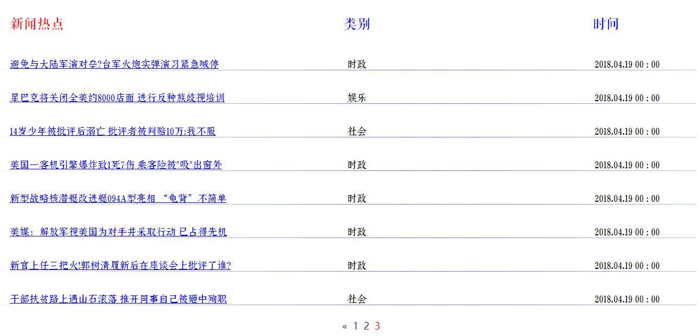
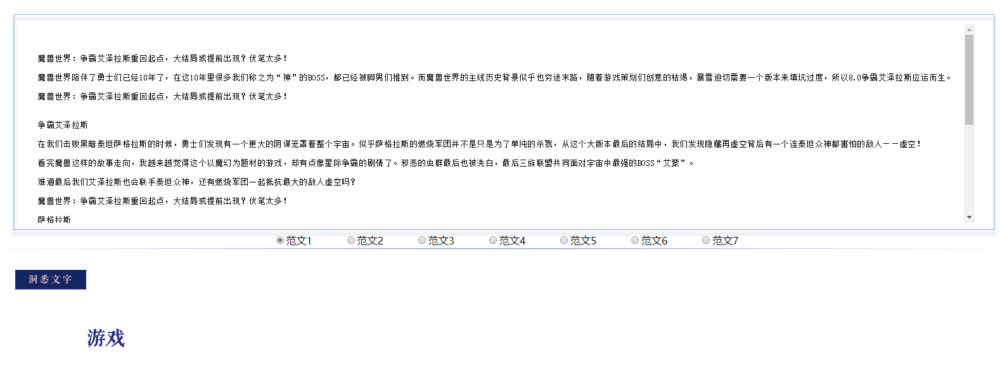

## 爬虫

详见`wangyinews_crawler.py`

## 数据库链接

详见`connect_mysql.py`


## 数据集

使用THUCNews全部数据进行训练与测试，数据集请自行到[THUCTC：一个高效的中文文本分类工具包](http://thuctc.thunlp.org/)下载，请遵循数据提供方的开源协议。

本次训练使用了其中的14个分类。

类别如下：

```
体育, 财经, 房产, 家居, 教育, 科技, 时尚, 时政, 游戏, 娱乐，股票，彩票，社会，星座
```

这个子集可以在此下载：链接: https://pan.baidu.com/s/1hugrfRu 密码: qfud

数据集划分如下：

- 训练集: 0.7
- 验证集: 0.15
- 测试集: 0.15

从原数据集生成子集的过程请参看`helper`下的`cnews_group.py`用于将多个文件整合到一个文件中。执行该文件后，得到三个数据文件：

- cnews.train.txt: 
- cnews.val.txt: 
- cnews.test.txt: 

## 预处理

`data/cnews_loader.py`为数据的预处理文件。

- `read_file()`: 读取文件数据;
- `build_vocab()`: 构建词汇表，使用字符级的表示，这一函数会将词汇表存储下来，避免每一次重复处理;
- `read_vocab()`: 读取上一步存储的词汇表，转换为`{词：id}`表示;
- `read_category()`: 将分类目录固定，转换为`{类别: id}`表示;
- `to_words()`: 将一条由id表示的数据重新转换为文字;
- `preocess_file()`: 将数据集从文字转换为固定长度的id序列表示;
- `batch_iter()`: 为神经网络的训练准备经过shuffle的批次的数据。

经过数据预处理，数据的格式如下：

| Data | Shape | Data | Shape |
| :---------- | :---------- | :---------- | :---------- |
| x_train | [585247, 600] | y_train | [585247, 14] |
| x_val | [125403, 600] | y_val | [125403, 14] |
| x_test | [125425, 600] | y_test | [125425, 14] |

## CNN卷积神经网络

### 配置项

CNN可配置的参数如下所示，在`cnn_model.py`中。

```python
class TCNNConfig(object):
    """CNN配置参数"""

    embedding_dim = 64  # 词向量维度
    seq_length = 600  # 序列长度
    num_classes = 14  # 类别数
    num_filters = 512  # 卷积核数目
    kernel_size = 9  # 卷积核尺寸
    vocab_size = 6000  # 词汇表达小

    hidden_dim = 128  # 全连接层神经元

    dropout_keep_prob = 0.6  # dropout保留比例
    learning_rate = 1e-3  # 学习率

    batch_size = 128  # 每批训练大小
    num_epochs = 10  # 总迭代轮次

    print_per_batch = 1000  # 每多少轮输出一次结果
    save_per_batch = 10  # 每多少轮存入tensorboard
```

### CNN模型

具体参看`cnn_model.py`的实现。

大致结构如下：


### 训练与验证

运行 `python run_cnn.py train`，可以开始训练。

> 若之前进行过训练，请把tensorboard/textcnn删除，避免TensorBoard多次训练结果重叠。

```
Configuring TensorBoard and Saver...
Loading training and validation data...
Time usage: 0:09:09
2018-04-06 22:03:56.913969: I T:\src\github\tensorflow\tensorflow\core\platform\cpu_feature_guard.cc:140] Your CPU supports instructions that this TensorFlow binary was not compiled to use: AVX2
2018-04-06 22:03:57.574615: I T:\src\github\tensorflow\tensorflow\core\common_runtime\gpu\gpu_device.cc:1344] Found device 0 with properties:
name: Tesla P100-PCIE-16GB major: 6 minor: 0 memoryClockRate(GHz): 1.3285
pciBusID: 0000:00:08.0
totalMemory: 15.91GiB freeMemory: 15.50GiB
2018-04-06 22:03:57.574811: I T:\src\github\tensorflow\tensorflow\core\common_runtime\gpu\gpu_device.cc:1423] Adding visible gpu devices: 0
2018-04-06 22:06:25.657284: I T:\src\github\tensorflow\tensorflow\core\common_runtime\gpu\gpu_device.cc:911] Device interconnect StreamExecutor with strength 1 edge matrix:
2018-04-06 22:06:25.657401: I T:\src\github\tensorflow\tensorflow\core\common_runtime\gpu\gpu_device.cc:917]      0
2018-04-06 22:06:25.658838: I T:\src\github\tensorflow\tensorflow\core\common_runtime\gpu\gpu_device.cc:930] 0:   N
2018-04-06 22:06:25.691139: I T:\src\github\tensorflow\tensorflow\core\common_runtime\gpu\gpu_device.cc:1041] Created TensorFlow device (/job:localhost/replica:0/task:0/device:GPU:0 with 15039 MB memory) -> physical GPU (device: 0, name: Tesla P100-PCIE-16GB, pci bus id: 0000:00:08.0, compute capability: 6.0)
Training and evaluating...
Epoch: 1
Iter:      0, Train Loss:    2.6, Train Acc:  14.06%, Val Loss:    2.6, Val Acc:  18.46%, Time: 0:00:20 *
Iter:   1000, Train Loss:   0.25, Train Acc:  91.41%, Val Loss:   0.57, Val Acc:  83.44%, Time: 0:01:13 *
Iter:   2000, Train Loss:   0.33, Train Acc:  92.97%, Val Loss:   0.58, Val Acc:  83.11%, Time: 0:02:06
Iter:   3000, Train Loss:   0.18, Train Acc:  96.09%, Val Loss:   0.54, Val Acc:  84.72%, Time: 0:02:59 *
Iter:   4000, Train Loss:   0.19, Train Acc:  92.97%, Val Loss:   0.51, Val Acc:  84.84%, Time: 0:03:52 *
Epoch: 2
Iter:   5000, Train Loss:  0.087, Train Acc:  96.88%, Val Loss:   0.52, Val Acc:  84.83%, Time: 0:04:46
Iter:   6000, Train Loss:   0.14, Train Acc:  96.88%, Val Loss:   0.52, Val Acc:  85.21%, Time: 0:05:39 *
Iter:   7000, Train Loss:   0.29, Train Acc:  92.97%, Val Loss:   0.53, Val Acc:  85.06%, Time: 0:06:32
Iter:   8000, Train Loss:   0.13, Train Acc:  96.88%, Val Loss:   0.54, Val Acc:  84.69%, Time: 0:07:24
Iter:   9000, Train Loss:   0.16, Train Acc:  95.31%, Val Loss:   0.52, Val Acc:  84.90%, Time: 0:08:17
Epoch: 3
Iter:  10000, Train Loss:   0.12, Train Acc:  96.09%, Val Loss:   0.57, Val Acc:  83.93%, Time: 0:09:11
Iter:  11000, Train Loss:  0.082, Train Acc:  97.66%, Val Loss:   0.56, Val Acc:  84.58%, Time: 0:10:04
Iter:  12000, Train Loss:   0.12, Train Acc:  95.31%, Val Loss:   0.56, Val Acc:  84.67%, Time: 0:23:15
Iter:  13000, Train Loss:   0.14, Train Acc:  95.31%, Val Loss:   0.55, Val Acc:  84.99%, Time: 0:24:08
Epoch: 4
Iter:  14000, Train Loss:   0.11, Train Acc:  95.31%, Val Loss:   0.59, Val Acc:  85.23%, Time: 0:25:03 *
Iter:  15000, Train Loss:   0.17, Train Acc:  94.53%, Val Loss:   0.64, Val Acc:  84.65%, Time: 0:25:56
Iter:  16000, Train Loss:   0.11, Train Acc:  96.09%, Val Loss:   0.64, Val Acc:  83.83%, Time: 0:26:48
Iter:  17000, Train Loss:   0.13, Train Acc:  94.53%, Val Loss:   0.62, Val Acc:  84.13%, Time: 0:27:41
Iter:  18000, Train Loss:  0.054, Train Acc:  99.22%, Val Loss:   0.62, Val Acc:  84.48%, Time: 0:28:34
Epoch: 5
Iter:  19000, Train Loss:  0.076, Train Acc:  98.44%, Val Loss:   0.69, Val Acc:  84.41%, Time: 0:32:38
Iter:  20000, Train Loss:  0.062, Train Acc:  96.88%, Val Loss:   0.74, Val Acc:  84.36%, Time: 0:35:25
Iter:  21000, Train Loss:   0.11, Train Acc:  97.66%, Val Loss:   0.72, Val Acc:  83.92%, Time: 0:36:18
Iter:  22000, Train Loss:   0.15, Train Acc:  93.75%, Val Loss:   0.65, Val Acc:  83.98%, Time: 0:37:11
Epoch: 6
Iter:  23000, Train Loss:  0.056, Train Acc:  96.88%, Val Loss:   0.79, Val Acc:  84.31%, Time: 0:38:05
Iter:  24000, Train Loss:  0.071, Train Acc:  97.66%, Val Loss:   0.75, Val Acc:  83.90%, Time: 0:38:57
No optimization for a long time, auto-stopping...

```

在验证集上的最佳效果为85.23%。


### 测试

运行 `python run_cnn.py test` 在测试集上进行测试。

```
Configuring CNN model...
WARNING:tensorflow:From C:\Anaconda3\lib\site-packages\tensorflow\python\util\deprecation.py:497: calling conv1d (from tensorflow.python.ops.nn_ops) with data_format=NHWC is deprecated and will be removed in a future version.
Instructions for updating:
`NHWC` for data_format is deprecated, use `NWC` instead
WARNING:tensorflow:From C:\Users\Administrator\Desktop\text_classification\cnn_model.py:66: softmax_cross_entropy_with_logits (from tensorflow.python.ops.nn_ops) is deprecated and will be removed in a future version.
Instructions for updating:

Future major versions of TensorFlow will allow gradients to flow
into the labels input on backprop by default.

See tf.nn.softmax_cross_entropy_with_logits_v2.

Loading test data...
2018-04-06 22:56:42.164669: I T:\src\github\tensorflow\tensorflow\core\platform\cpu_feature_guard.cc:140] Your CPU supports instructions that this TensorFlow binary was not compiled to use: AVX2
2018-04-06 22:56:42.612697: I T:\src\github\tensorflow\tensorflow\core\common_runtime\gpu\gpu_device.cc:1344] Found device 0 with properties:
name: Tesla P100-PCIE-16GB major: 6 minor: 0 memoryClockRate(GHz): 1.3285
pciBusID: 0000:00:08.0
totalMemory: 15.91GiB freeMemory: 15.50GiB
2018-04-06 22:56:42.612903: I T:\src\github\tensorflow\tensorflow\core\common_runtime\gpu\gpu_device.cc:1423] Adding visible gpu devices: 0
2018-04-06 22:56:43.294863: I T:\src\github\tensorflow\tensorflow\core\common_runtime\gpu\gpu_device.cc:911] Device interconnect StreamExecutor with strength 1 edge matrix:
2018-04-06 22:56:43.295002: I T:\src\github\tensorflow\tensorflow\core\common_runtime\gpu\gpu_device.cc:917]      0
2018-04-06 22:56:43.298126: I T:\src\github\tensorflow\tensorflow\core\common_runtime\gpu\gpu_device.cc:930] 0:   N
2018-04-06 22:56:43.299510: I T:\src\github\tensorflow\tensorflow\core\common_runtime\gpu\gpu_device.cc:1041] Created TensorFlow device (/job:localhost/replica:0/task:0/device:GPU:0 with 15039 MB memory) -> physical GPU (device: 0, name: Tesla P100-PCIE-16GB, pci bus id: 0000:00:08.0, compute capability: 6.0)
Testing...
Test Loss:   0.28, Test Acc:  92.24%
Precision, Recall and F1-Score...
             precision    recall  f1-score   support

         体育       0.98      0.99      0.99     19741
         财经       0.83      0.77      0.80      5565
         房产       1.00      1.00      1.00      3007
         家居       0.94      0.93      0.94      4888
         教育       0.93      0.93      0.93      6290
         科技       0.91      0.97      0.94     24439
         时尚       0.88      0.91      0.89      2005
         时政       0.84      0.93      0.88      9463
         游戏       0.90      0.87      0.88      3656
         娱乐       0.95      0.94      0.94     13895
         股票       0.93      0.87      0.90     23160
         彩票       0.97      0.85      0.91      1138
         社会       0.91      0.84      0.87      7627
         星座       0.98      0.87      0.92       537

avg / total       0.92      0.92      0.92    125411

Confusion Matrix...
[[19548     0     0     4     6    45     2    10     6    89     5     8
     18     0]
 [    0  4273     0    11     0    11     0    85     0     3  1169     0
     13     0]
 [    0     0  3005     1     0     0     0     0     0     0     1     0
      0     0]
 [   11     5    10  4558    26    23    92     8     1   129    12     0
     10     3]
 [   21     2     0    12  5874    59    17   116     5    23    40     0
    121     0]
 [    8    14     0   106    28 23621    37    49   308    53   174     1
     39     1]
 [    3     0     0    29    22    17  1817    37     1    50     1     0
     25     3]
 [   47    12     1     8    91   201     0  8787     1    42   106     5
    162     0]
 [   33     1     0     6    14   312     9     9  3187    68     6     0
     11     0]
 [  118     1     0    26    39   228    52   125    31 13090    55     0
    128     2]
 [   14   787     1    39    34  1150     3   852    10    74 20112     0
     82     2]
 [  100     1     0     1     3     5     0     5     0    11     2   963
     47     0]
 [   26    81     1    19   165   369    11   350     2   175    33    13
   6382     0]
 [    3     0     0     7     6     0    24     1     4    24     2     0
      0   466]]
Time usage: 0:01:37
```

在测试集上的准确率达到了92.24%，F1-Score除了财经类是0.80，其他都在0.9左右，效果算是挺不错的。

## 对网易排行榜新闻进行爬取并分类
每个整点爬取一次,每次爬取20条。爬取数目在`wangyinews_crawler.py`中line 43,linmit中修改。


## Python 网络编程
Server/Client代码详见`server_predict.py`, `client.py`。

## 输入文章内容进行分类
提供多个范文供读者尝试。也可以自行输入文字。
